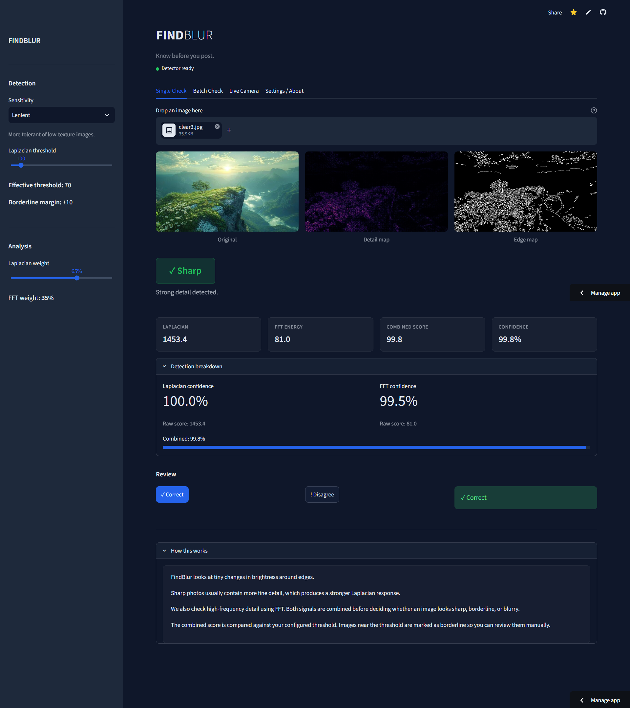
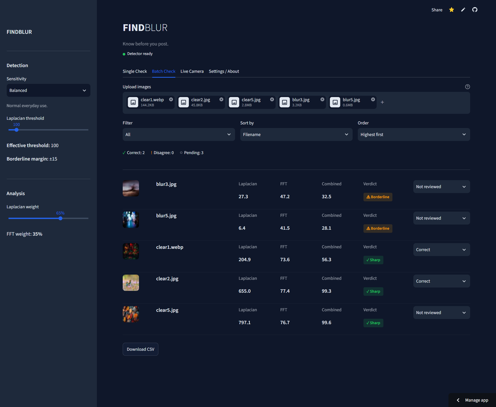
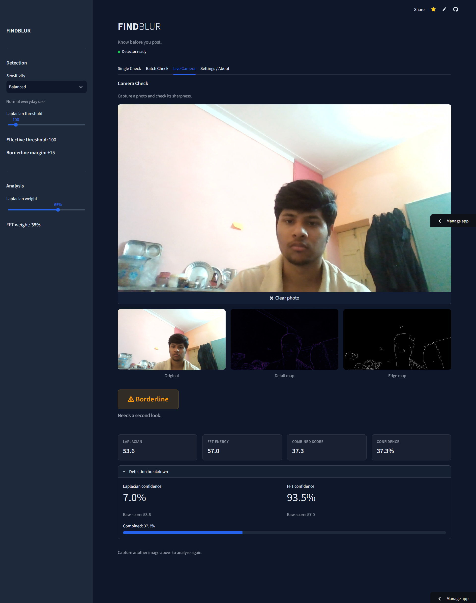
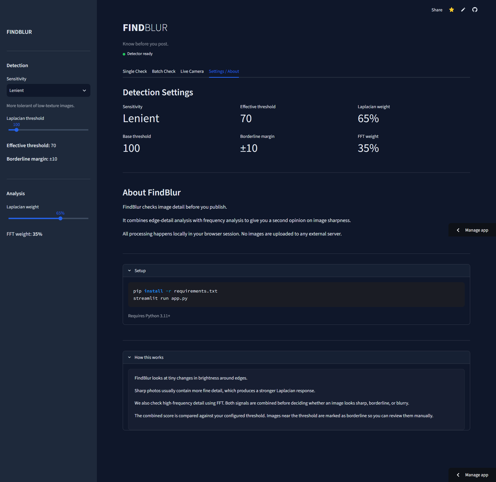

# 🔎 FindBlur

<div align="center">

### Know before you post.

A computer-vision tool for detecting image blur and sharpness using  
**OpenCV, Laplacian Variance, FFT analysis, and Streamlit.**

<br>

[](https://findblur-hvflnggfs2adoxzgy26wvg.streamlit.app/)


</div>

---

## 🚀 Live Demo

### [Launch FindBlur →](https://findblur-hvflnggfs2adoxzgy26wvg.streamlit.app/)

FindBlur checks image detail and gives you a practical second opinion before you publish or use an image.

**🟢 Sharp · 🟡 Borderline · 🔴 Blurry**

---

## 📌 About

**FindBlur** is an image sharpness and blur detection application built with **Python, OpenCV, NumPy, and Streamlit**.

Instead of relying on a single blur metric, FindBlur combines **Laplacian variance** with **FFT-based high-frequency analysis** to evaluate image detail from two different perspectives.

The final result is classified into three categories:

- 🟢 **Sharp** — strong image detail detected
- 🟡 **Borderline** — result is close to the configured threshold and should be reviewed
- 🔴 **Blurry** — insufficient detail detected

The detection system is configurable, allowing users to adjust the threshold, sensitivity, and metric weighting according to their use case.

---

# ✨ Features

### 🔍 Dual-Metric Blur Detection

FindBlur combines:

- **Laplacian Variance** for edge/detail detection
- **FFT analysis** for high-frequency energy
- Weighted score combination
- Confidence-based result interpretation

### 🎯 Three-Level Classification

| Verdict | Description |
|---|---|
| 🟢 **Sharp** | Strong detail detected |
| 🟡 **Borderline** | Needs a second look |
| 🔴 **Blurry** | Low detail detected |

### ⚙️ Adjustable Detection

- Laplacian threshold from `0–1000`
- Strict sensitivity
- Balanced sensitivity
- Lenient sensitivity
- Adjustable Laplacian/FFT weighting
- Automatic effective threshold and borderline margin

### 🖼️ Single Image Check

Upload an image and inspect:

- Original image
- Detail map
- Edge map
- Laplacian score
- FFT energy
- Combined score
- Confidence
- Final verdict

### 📁 Batch Check

Analyze multiple images in one session with:

- Batch processing
- Progress indication
- Image thumbnails
- Individual detection scores
- Verdict filtering
- Score sorting
- Filename sorting
- Manual review
- CSV export

### 📷 Live Camera

Use your device camera directly through the Streamlit interface to capture and analyze an image.

### 🧭 Visual Diagnostics

FindBlur provides visual representations of image detail using:

- Laplacian-based detail mapping
- Canny edge detection
- Original vs. processed image comparison

### 📝 Manual Review

Each result can be manually marked as:

- ✅ Correct
- ⚠️ Disagree
- ○ Not reviewed

This makes the tool useful when automated detection is uncertain.

---

# 📸 Application Preview

## 🔍 Single Image Check

Upload an image and instantly inspect its sharpness score, verdict, detail map, and edge map.

<p align="center">
  
</p>

---

## 📁 Batch Image Analysis

Process multiple images, sort and filter results, manually review classifications, and export the results as CSV.

<p align="center">
  
</p>

---

## 📷 Live Camera Detection

Capture an image directly through your camera and analyze its sharpness.

<p align="center">
  
</p>

---

## ⚙️ Detection Settings

Configure sensitivity, threshold, and the relative contribution of Laplacian and FFT analysis.

<p align="center">
  
</p>

---

# 🧠 How It Works

FindBlur uses two complementary image-analysis techniques.

```text
                       INPUT IMAGE
                            │
                            ▼
                     GRAYSCALE IMAGE
                            │
                 ┌──────────┴──────────┐
                 │                     │
                 ▼                     ▼
          LAPLACIAN VARIANCE         FFT
                 │                     │
                 ▼                     ▼
            EDGE DETAIL          HIGH-FREQUENCY
               SCORE                 ENERGY
                 │                     │
                 └──────────┬──────────┘
                            ▼
                     NORMALIZATION
                            │
                            ▼
                    WEIGHTED COMBINATION
                            │
                            ▼
                  SENSITIVITY ADJUSTMENT
                            │
                            ▼
                  THRESHOLD COMPARISON
                            │
              ┌─────────────┼─────────────┐
              ▼             ▼             ▼
           SHARP       BORDERLINE       BLURRY
